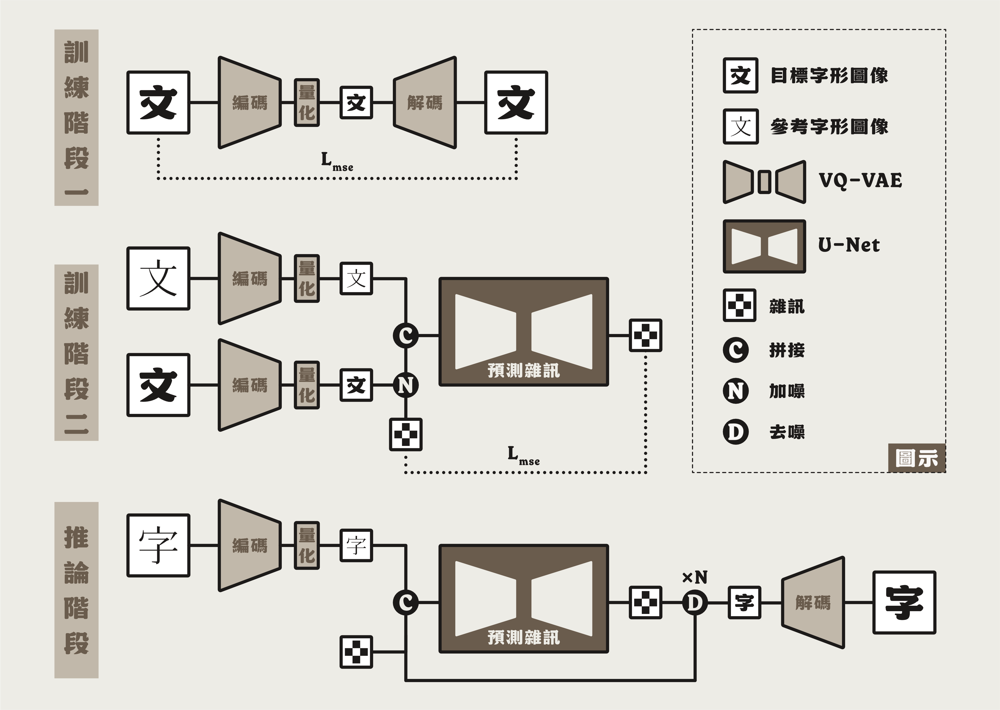

<div align="center">

# 字生字：漢字字形補全系統


</div>

## 📌 專案簡介

「字生字」是一套基於深度學習的漢字字形補全系統，整合字型分析、缺字生成與字形向量化等自動化流程，可協助設計師加速字型開發與補全工作。本系統可應用於字型設計，亦適合作為教學與研究的實作範例。


### 方法概述
本專案採用 **潛在擴散模型（Latent Diffusion Model, LDM）** 作為圖像生成核心。透過兩階段的訓練策略，模型能有效降低運算成本，並學習目標字型的風格特徵，進而利用參考字型作為結構引導，生成缺失的字形圖像。


### 主要特色
- **模組化流程**：整合字型分析至字形向量化一系列流程，並具備高度自訂性。
- **低硬體門檻**：僅需 4GB VRAM 的 NVIDIA 顯示卡，即可完成訓練與推論。
- **高品質輸出**：支援生成解析度達 512 × 512 像素以上的清晰字形圖像。

> [!IMPORTANT]
> - 本專案非通用模型，每種目標字型都必須獨立完成訓練流程。
> - 本專案不含任何字型檔案，請自行準備目標字型與參考字型。
> - 本專案不提供預訓練模型，請依照使用說明並自行訓練模型。

---

## 🏗️ 模型架構

本專案採用的 **潛在擴散模型（LDM）** 由 **向量量化自編碼器（VQ-VAE）** 與  **U-Net** 兩大組件構成。VQ-VAE 負責將輸入的字形圖像壓縮為離散的潛在向量，並保留字體的風格與結構特徵。隨後，LDM 利用 U-Net 在此潛在空間中執行加噪與去噪流程，藉此生成高品質且風格一致的字形圖像。

### 訓練流程
- **訓練階段一**：訓練 VQ-VAE，使其能夠將字形圖像編碼為離散潛在向量，並重建原始圖像，以均方誤差（MSE）作為損失函數。
- **訓練階段二**：利用訓練好的 VQ-VAE 將目標字形與參考字形編碼為潛在向量。接著，對目標向量加入雜訊，與參考向量拼接後，送入 U-Net 預測雜訊，以預測誤差（MSE）作為損失函數。
- **推論階段**：從純雜訊出發，結合參考字形的潛在向量，透過 DDIM 去噪流程，在潛在空間中逐步去噪，最終解碼還原出缺失的目標字形圖像。




---

## ✨ 生成樣本

下圖展示了「字生字」在其他多種目標字型上的生成效果。第一排為參考字形圖像；第二排為模型生成的字形圖像；第三排為實際應有的目標字形圖像（未收錄者以虛線叉號標示）。


---

## 🚀 使用說明

### 1. 建置環境 ⚙️

此步驟將建立本專案所需的 Python 環境並安裝相關套件。

> [!IMPORTANT]
> - **作業系統**：Linux、Windows（建議使用 WSL2）。
> - **硬體需求**：至少 4GB VRAM 的 NVIDIA 顯示卡。
> - **驅動程式**：相容於 CUDA 11.8 或以上版本的 NVIDIA 驅動程式。

#### 1-1 下載本專案
```bash
git clone https://github.com/wangwenho/HanziGen.git
cd HanziGen
```

#### 1-2 建立 Conda 環境
> [!NOTE]
> - 若尚未安裝 Anaconda，請參考 [Anaconda 官方網站](https://www.anaconda.com/download/success) 安裝對應的平台版本。

```bash
conda create -n hanzigen python=3.13 -y
conda activate hanzigen
```

#### 1-3 安裝 PyTorch
```bash
pip install torch==2.7.1 torchvision==0.22.1 torchaudio==2.7.1 --index-url https://download.pytorch.org/whl/cu118
```
> [!NOTE]
> - 若需安裝其他版本的 PyTorch，請參考 [PyTorch 官方網站](https://pytorch.org/get-started/previous-versions/) 取得對應的安裝指令。

#### 1-4 安裝其餘套件
```bash
pip install -r requirements.txt
```

---

### 2. 準備字型檔案 🖋️

此步驟將準備專案所需的目標字型與參考字型檔案。

#### 2-1 建立資料夾
   - 在專案根目錄建立 `fonts/` 資料夾。

#### 2-2 放置目標字型
   - 選擇一款欲補全的目標字型（`.ttf` 或 `.otf` 格式）。
   - 將目標字型檔案放入 `fonts/` 資料夾。

#### 2-3 放置參考字型
   - 前往 [Jigmo 官方網站](https://kamichikoichi.github.io/jigmo/) 下載 Jigmo 字型作為參考字型。
   - 在 `fonts/` 資料夾內建立 `jigmo/` 子資料夾。
   - 將下載的 `jigmo.ttf`、`jigmo2.ttf`、`jigmo3.ttf` 檔案放入 `fonts/jigmo/` 資料夾。

> [!CAUTION]
> - 請確認目標字型的授權條款允許修改再發布。
> - 請確保目標字型的檔名不含空格或特殊字元。

> [!TIP]
> - 建議選用至少包含 2000 個漢字的目標字型，以獲得更好的補全效果。

<details>
<summary>📁 查看檔案結構</summary>

```
fonts/
├── [target_font].[ttf_or_otf]
└── jigmo/
    ├── jigmo.ttf
    ├── jigmo2.ttf
    └── jigmo3.ttf
```
- `[target_font].[ttf_or_otf]`：欲補全的目標字型檔案。
- `jigmo/`：存放參考字型的資料夾。
  - `jigmo.ttf`、`jigmo2.ttf`、`jigmo3.ttf`：Jigmo 系列參考字型檔案。

</details>

---

### 3. 分析字型漢字覆蓋率 📊

此步驟將分析目標字型與參考字型在 [jf7000](https://justfont.com/jf7000) 與 [Unihan](https://www.unicode.org/charts/unihan.html) 字集中的漢字覆蓋情況，並產生對應的覆蓋與缺失字集。

#### 3-1 設定參數
- 開啟 [`scripts/sh/analyze_font.sh`](scripts/sh/analyze_font.sh)。
- 設定 `TARGET_FONT_PATH` 為你的目標字型路徑（例如：`"fonts/target_font.ttf"`）。
- 調整其他參數（可選）。

<details>
<summary>📋 查看腳本參數</summary>

- `TARGET_FONT_PATH`：目標字型檔案路徑（字串）。
- `REFERENCE_FONTS_DIR`：參考字型資料夾路徑（字串）。

</details>

#### 3-2 執行腳本
> [!IMPORTANT]
> - 請依照您的系統環境選擇對應的腳本執行。
> - Windows 使用者建議使用 WSL2。

- **Linux/WSL2 環境（Bash）**
```bash
bash scripts/sh/analyze_font.sh
```
- **Windows 原生環境（PowerShell）**
```bat
scripts\bat\analyze_font.bat
```

#### 3-3 查看輸出
- 覆蓋率統計：目標字型與參考字型對 `jf7000` 和 `Unihan` 各子字集的覆蓋率將顯示於終端機。
- 檔案輸出：覆蓋（`covered.txt`）與缺失（`missing.txt`）字集檔案將儲存在 `charsets/` 資料夾中。

<details>
<summary>📊 查看覆蓋率統計</summary>

```
                        Jigmo jf7000 Coverage Statistics                         
┏━━━━━━━━━━━━━━━━━━━┳━━━━━━━┳━━━━━━━━━┳━━━━━━━━━┳━━━━━━━━━━━━━━━┳━━━━━━━━━━━━━━━┓
┃ Charset           ┃ Total ┃ Covered ┃ Missing ┃ Covered Ratio ┃ Missing Ratio ┃
┡━━━━━━━━━━━━━━━━━━━╇━━━━━━━╇━━━━━━━━━╇━━━━━━━━━╇━━━━━━━━━━━━━━━╇━━━━━━━━━━━━━━━┩
│ basic.txt         │  6373 │    6373 │       0 │       100.00% │         0.00% │
│ ext_cantonese.txt │   127 │     117 │      10 │        92.13% │         7.87% │
│ ext_japan.txt     │   534 │     533 │       1 │        99.81% │         0.19% │
│ ext_naming.txt    │   618 │     611 │       7 │        98.87% │         1.13% │
│ ext_taiwan.txt    │   810 │     700 │     110 │        86.42% │        13.58% │
│ jf7000_all.txt    │  8349 │    8221 │     128 │        98.47% │         1.53% │
└───────────────────┴───────┴─────────┴─────────┴───────────────┴───────────────┘
```
- `basic.txt`：jf7000 漢字基本包。
- `ext_cantonese.txt`：jf7000 港澳擴充包。
- `ext_japan.txt`：jf7000 日文擴充包。
- `ext_naming.txt`：jf7000 臺灣命名擴充包。
- `ext_taiwan.txt`：jf7000 本土語言擴充包。
- `jf7000_all.txt`：上述子字集的集合字集。

---

```
                        Jigmo unihan Coverage Statistics                        
┏━━━━━━━━━━━━━━━━━┳━━━━━━━━┳━━━━━━━━━┳━━━━━━━━━┳━━━━━━━━━━━━━━━┳━━━━━━━━━━━━━━━┓
┃ Charset         ┃  Total ┃ Covered ┃ Missing ┃ Covered Ratio ┃ Missing Ratio ┃
┡━━━━━━━━━━━━━━━━━╇━━━━━━━━╇━━━━━━━━━╇━━━━━━━━━╇━━━━━━━━━━━━━━━╇━━━━━━━━━━━━━━━┩
│ basic.txt       │  20992 │   20992 │       0 │       100.00% │         0.00% │
│ compat.txt      │    472 │     472 │       0 │       100.00% │         0.00% │
│ compat_supp.txt │    542 │       0 │     542 │         0.00% │       100.00% │
│ ext_a.txt       │   6592 │    6592 │       0 │       100.00% │         0.00% │
│ ext_b.txt       │  42720 │       1 │   42719 │         0.00% │       100.00% │
│ ext_c.txt       │   4160 │       0 │    4160 │         0.00% │       100.00% │
│ ext_d.txt       │    222 │       0 │     222 │         0.00% │       100.00% │
│ ext_e.txt       │   5774 │       0 │    5774 │         0.00% │       100.00% │
│ ext_f.txt       │   7473 │       0 │    7473 │         0.00% │       100.00% │
│ ext_g.txt       │   4939 │       0 │    4939 │         0.00% │       100.00% │
│ ext_h.txt       │   4192 │       0 │    4192 │         0.00% │       100.00% │
│ ext_i.txt       │    622 │       0 │     622 │         0.00% │       100.00% │
│ ext_j.txt       │   4298 │       0 │    4298 │         0.00% │       100.00% │
│ unihan_all.txt  │ 102998 │   28057 │   74941 │        27.24% │        72.76% │
└─────────────────┴────────┴─────────┴─────────┴───────────────┴───────────────┘
```
- `basic.txt`：中日韓統一表意文字字集。
- `compat.txt`：中日韓相容表意文字字集。
- `compat_supp.txt`：中日韓相容表意文字補充字集。
- `ext_a.txt`～`ext_j.txt`：中日韓統一表意文字擴充字集 A～J 區。
- `unihan_all.txt`：上述子字集的集合字集。

</details>

<details>
<summary>📁 查看檔案結構</summary>

```
charsets/
├── jf7000_coverage/
│   ├── [target_font]/
│   │   ├── covered.txt
│   │   └── missing.txt
│   └── ...
├── unihan_coverage/
│   ├── [target_font]/
│   │   ├── covered.txt
│   │   └── missing.txt
│   └── ...
└── ...
```
- `jf7000_coverage/`：儲存字型對於 `jf7000` 字集的覆蓋結果。
- `unihan_coverage/`：儲存字型對於 `Unihan` 字集的覆蓋結果。
  - `[target_font]/`：以目標字型命名的子目錄。
    - `covered.txt`：目標字型覆蓋字集檔案。
    - `missing.txt`：目標字型缺失字集檔案。

</details>

---

### 4. 準備字形圖像資料集 🖨️

此步驟將產生目標字型與參考字型的字形圖像，作為後續模型訓練所需的資料集。

#### 4-1 設定參數
  - 開啟 [`scripts/sh/prepare_dataset.sh`](scripts/sh/prepare_dataset.sh)。
  - 設定 `TARGET_FONT_PATH` 為你的目標字型路徑（例如：``"fonts/target_font.ttf"``）。
  - 調整其他參數（可選）。

<details>
<summary>📋 查看腳本參數</summary>

- `TARGET_FONT_PATH`：目標字型檔案路徑（字串）。
- `REFERENCE_FONTS_DIR`：參考字型資料夾路徑（字串）。
- `IMG_WIDTH`：字形圖像寬度（整數）。
- `IMG_HEIGHT`：字形圖像高度（整數）。
- `SAMPLE_RATIO`：抽樣比例（浮點數，範圍 0.0～1.0）。

</details>

> [!WARNING]
> - 請確保 `IMG_WIDTH` 與 `IMG_HEIGHT` 參數設定值相同。

> [!TIP]
> - 可調整 `SAMPLE_RATIO` 參數，以實驗不同的字形圖像資料集大小。

#### **4-2 執行腳本**
- **Linux/WSL2 環境**
```bash
bash scripts/sh/prepare_dataset.sh
```
- **Windows 原生環境**
```bat
scripts\bat\prepare_dataset.bat
```

#### 4-3 查看輸出
- 檔案輸出：目標字形（`target`）與參考字形（`reference`）圖像將儲存在 `data/` 資料夾中。
<details>
<summary>📁 查看檔案結構</summary>

```
data/
├── reference/
│   ├── 04E00.png
│   ├── 04E8C.png
│   ├── 04E09.png
│   └── ...
└── target/
    ├── 04E00.png
    ├── 04E8C.png
    ├── 04E09.png
    └── ...
```
- `reference/`：存放參考字形圖像的資料夾。
  - `04E00.png`：參考字形圖像，檔名為 Unicode 碼位。
- `target/`：存放目標字形圖像的資料夾。
  - `04E00.png`：目標字形圖像，檔名為 Unicode 碼位。

</details>

---

### 5. 劃分訓練／驗證字集 🎯

此步驟將劃分訓練字集與驗證字集。

#### 5-1 設定參數
   - 開啟 [`scripts/sh/split_dataset.sh`](scripts/sh/split_dataset.sh)。
   - 設定 `TARGET_FONT_PATH` 為你的目標字型路徑（例如：`"fonts/target_font.ttf"`）。
   - 調整其他參數（可選）。

<details>
<summary>📋 查看腳本參數</summary>

- `TARGET_FONT_PATH`：目標字型檔案路徑（字串）。
- `TRAIN_SPLIT_RATIO`：訓練字集比例（浮點數，範圍 0.0～1.0）。
- `VAL_SPLIT_RATIO`：驗證字集比例（浮點數，範圍 0.0～1.0）。
- `SPLIT_RANDOM_SEED`：劃分隨機種子（整數）。
- `DEVICE`：指定運算設備（字串）。

</details>

> [!WARNING]
> - 請確保 `TRAIN_SPLIT_RATIO` 與 `VAL_SPLIT_RATIO` 之和等於 1.0。 

> [!TIP]
> - 可調整 `TRAIN_SPLIT_RATIO` 、 `VAL_SPLIT_RATIO` 與 `SPLIT_RANDOM_SEED` 參數，以實驗不同的字集劃分。
> - 可調整 `DEVICE` 參數，以指定運算設備（例如：`"cuda"` 、 `"cuda:0"` 、 `"cuda:1"`）。

#### 5-2 執行腳本
- **Linux/WSL2 環境**
```bash
bash scripts/sh/split_dataset.sh
```
- **Windows 原生環境**
```bat
scripts\bat\split_dataset.bat
```

#### 5-3 查看輸出
- 檔案輸出： 劃分好的訓練字集（`train.txt`）與驗證字集（`val.txt`）檔案將儲存在 `charsets/` 資料夾中。
<details>
<summary>📁 查看檔案結構</summary>

```
charsets/
├── splits/
│   ├── [target_font]/
│   │   ├── train.txt
│   │   └── val.txt
│   └── ...
└── ...
```
- `[target_font]/`：以目標字型命名的子目錄。
  - `train.txt`：訓練字集檔案。
  - `val.txt`：驗證字集檔案。

</details>

---

### 6. 訓練 VQ-VAE 🏋️

此步驟將訓練 VQ-VAE 模型，作為字形圖像的編碼與解碼模組。

#### 6-1 設定參數
   - 開啟 [`scripts/sh/train_vqvae.sh`](scripts/sh/train_vqvae.sh)。
   - 設定 `TARGET_FONT_PATH` 為你的目標字型路徑（例如：`"fonts/target_font.ttf"`）。
   - 調整其他參數（可選）。

<details>
<summary>📋 查看腳本參數</summary>

- `TARGET_FONT_PATH`：目標字型檔案路徑（字串）。
- `TRAIN_SPLIT_RATIO`：訓練字集比例（浮點數，範圍 0.0～1.0）。
- `VAL_SPLIT_RATIO`：驗證字集比例（浮點數，範圍 0.0～1.0）。
- `SPLIT_RANDOM_SEED`：劃分隨機種子（整數）。
- `BATCH_SIZE`：訓練批次大小（整數）。
- `LEARNING_RATE`：學習率（浮點數）。
- `NUM_EPOCHS`：訓練週期數（整數）。
- `IMG_SAVE_INTERVAL`：生成樣本儲存週期間隔（整數）。
- `DEVICE`：指定運算設備（字串）。
- `RESUME`：是否從檢查點接續訓練（布林值：`true`/`false`）。
- `USE_AMP`：是否使用混合精度訓練（布林值：`true`/`false`）。

</details>

> [!WARNING]
> - 請確保 `TRAIN_SPLIT_RATIO` 、 `VAL_SPLIT_RATIO` 與 `SPLIT_RANDOM_SEED` 參數與 5. 一致。

> [!TIP]
> - 可調整 `BATCH_SIZE`、`LEARNING_RATE` 與 `NUM_EPOCHS` 參數，以實驗不同的訓練設定。
> - 可調整 `DEVICE` 參數，以指定運算設備（例如：`"cuda"` 、 `"cuda:0"` 、 `"cuda:1"`）。
> - 若您使用 RTX 20 系列或更高階顯卡，強烈建議開啟 `USE_AMP` 參數。
> - 開啟 `RESUME` 參數，可從先前的檢查點（checkpoint）恢復訓練進度。

> [!NOTE]
> - 如需進一步自訂 VQ-VAE 架構，請參考 [`configs/vqvae_config.py`](configs/vqvae_config.py) 中的 `VQVAEModelConfig` 類別。

#### 6-2 執行腳本
- **Linux/WSL2 環境**
```bash
bash scripts/sh/train_vqvae.sh
```
- **Windows 原生環境**
```bat
scripts\bat\train_vqvae.bat
```

> [!TIP]
> - 訓練過程中，可透過 `tensorboard --logdir=runs/VQVAE_[target_font]` 查看訓練狀態。

#### 6-3 查看輸出
- 訓練狀態：VQ-VAE 各週期的訓練狀態與損失將顯示於終端機。
- 訓練記錄：TensorBoard 訓練紀錄將儲存在 `runs/` 資料夾中。
- 模型權重：VQ-VAE 模型權重將儲存在 `checkpoints/` 資料夾中。
- 生成樣本：訓練與驗證樣本圖像將儲存在 `samples_[target_font]/` 資料夾中。

<details>
<summary>📈 查看訓練狀態</summary>

```
✅ Best model saved (val loss: 0.002913)
          Epoch Status [20/100]     
┏━━━━━━━━━━━━━━━┳━━━━━━━━━━━━┳━━━━━━━━━━┓
┃ Metric        ┃ Train Loss ┃ Val Loss ┃
┡━━━━━━━━━━━━━━━╇━━━━━━━━━━━━╇━━━━━━━━━━┩
│ Total         │   0.003001 │ 0.002913 │
│ Recon         │   0.001008 │ 0.000985 │
│ Vq            │   0.001993 │ 0.001928 │
│ Learning Rate │   0.000914 │        - │
└───────────────┴────────────┴──────────┘
```
- `✅ Best model saved`：當驗證集總損失（Val Total Loss）優於歷史最佳時，系統將自動儲存模型權重。
- `Epoch Status`：顯示目前訓練進度（當前週期 / 總週期）。
- `Train Loss` / `Val Loss`：訓練集與驗證集的損失值。
- `Total`：總損失（Total Loss）。
- `Recon`：重建損失（Reconstruction Loss）。
- `Vq`：向量量化損失（Vector Quantization Loss）。
- `Learning Rate`：當前學習率。

</details>

<details>
<summary>📁 查看檔案結構</summary>

```
runs/
├── VQVAE_[target_font]/
│   └── [YYYYMMDD_HHMMSS]/
│       └── events.out.tfevents.xxxxx
└── ...
```
- `VQVAE_[target_font]/`：以目標字型命名的子目錄。
  - `YYYYMMDD_HHMMSS/`：以訓練啟動的時間戳記命名的資料夾。
    - `events.out.tfevents.xxxxx`：TensorBoard 訓練紀錄檔案。

---

```
checkpoints/
├── vqvae_[target_font].pth
└── ...
```
- `vqvae_[target_font].pth`：VQ-VAE 模型權重檔案。

---

```
samples_[target_font]/
├── vqvae_training_[YYYYMMDD_HHMMSS]/
│   ├── train/
│   │   ├── epoch_0000_tgt_04E00.png
│   │   ├── epoch_0000_ref_04E8C.png
│   │   └── ...
│   └── val/
│       ├── epoch_0000_tgt_056DB.png
│       ├── epoch_0000_ref_04E94.png
│       └── ...
└── ...
```
- `vqvae_training_[YYYYMMDD_HHMMSS]/`：以訓練啟動的時間戳記命名的子目錄。
- `train/`：訓練樣本圖像資料夾。
  - `epoch_0000_tgt_04E00.png`：以當前週期與 Unicode 碼位命名的字形圖像檔案，圖片分為左右兩個部分，分別為目標字形與重建字形。
  - `epoch_0000_ref_04E8C.png`：以當前週期與 Unicode 碼位命名的字形圖像檔案，圖片分為左右兩個部分，分別為參考字形與重建字形。
- `val/`：驗證樣本圖像資料夾。
  - `epoch_0000_tgt_056DB.png`：以當前週期與 Unicode 碼位命名的字形圖像檔案，圖片分為左右兩個部分，分別為目標字形與重建字形。
  - `epoch_0000_ref_04E94.png`：以當前週期與 Unicode 碼位命名的字形圖像檔案，圖片分為左右兩個部分，分別為參考字形與重建字形。

</details>

---

### 7. 訓練 LDM 🏋️
此步驟將訓練 LDM，作為最終的字形生成模型。

#### 7-1 設定參數
  - 開啟 [`scripts/sh/train_ldm.sh`](scripts/sh/train_ldm.sh)。
  - 設定 `TARGET_FONT_PATH` 為你的目標字型路徑（例如：`"fonts/target_font.ttf"`）。
  - 調整其他參數（可選）。

<details>
<summary>📋 查看腳本參數</summary>

- `TARGET_FONT_PATH`：目標字型檔案路徑（字串）。
- `TRAIN_SPLIT_RATIO`：訓練字集比例（浮點數，範圍 0.0～1.0）。
- `VAL_SPLIT_RATIO`：驗證字集比例（浮點數，範圍 0.0～1.0）。
- `SPLIT_RANDOM_SEED`：劃分隨機種子（整數）。
- `BATCH_SIZE`：訓練批次大小（整數）。
- `LEARNING_RATE`：學習率（浮點數）。
- `NUM_EPOCHS`：訓練週期數（整數）。
- `SAMPLE_STEPS`：生成樣本去噪步驟數（整數）。
- `IMG_SAVE_INTERVAL`：生成樣本儲存週期間隔（整數）。
- `LPIPS_EVAL_INTERVAL`：LPIPS 評估週期間隔（整數）。
- `EVAL_BATCH_SIZE`：評估批次大小（整數）。
- `DEVICE`：指定運算設備（字串）。
- `RESUME`：是否從檢查點接續訓練（布林值：`true`/`false`）。
- `USE_AMP`：是否使用混合精度訓練（布林值：`true`/`false`）。

</details>

> [!WARNING]
> - 請確保 `TRAIN_SPLIT_RATIO` 、 `VAL_SPLIT_RATIO` 與 `SPLIT_RANDOM_SEED` 參數與 5. 一致。

> [!TIP]
> - 可調整 `BATCH_SIZE`、`LEARNING_RATE` 與 `NUM_EPOCHS` 參數，以實驗不同的訓練設定。
> - 可調整 `DEVICE` 參數，以指定運算設備（例如：`"cuda"` 、 `"cuda:0"` 、 `"cuda:1"`）。
> - 若您使用 RTX 20 系列或更高階顯卡，強烈建議開啟 `USE_AMP` 參數。
> - 開啟 `RESUME` 參數，可從先前的檢查點（checkpoint）恢復訓練進度。

> [!NOTE]
> - 如需進一步自訂 LDM 架構，請參考 [`configs/ldm_config.py`](configs/ldm_config.py) 中的 `LDMModelConfig` 類別。

#### 7-2 執行腳本
- **Linux/WSL2 環境**
```bash
bash scripts/sh/train_ldm.sh
```
- **Windows 原生環境**
```bat
scripts\bat\train_ldm.bat
```

> [!TIP]
> - 訓練過程中，可透過 `tensorboard --logdir=runs/LDM_[target_font]` 查看訓練狀態。

#### 7-3 查看輸出
- 訓練狀態：LDM 各週期的訓練狀態與損失將顯示於終端機。
- 訓練記錄：TensorBoard 訓練紀錄將儲存在 `runs/` 資料夾中。
- 模型權重：LDM 模型權重將儲存在 `checkpoints/` 資料夾中。
- 生成樣本： 訓練與驗證樣本圖像將儲存在 `samples_[target_font]/` 資料夾中。


<details>
<summary>📈 查看訓練狀態</summary>

```
✅ Best model saved. (LPIPS score: 0.181055)
          Epoch Status [20/250]     
┏━━━━━━━━━━━━━━━┳━━━━━━━━━━━━┳━━━━━━━━━━┓
┃ Metric        ┃ Train Loss ┃ Val Loss ┃
┡━━━━━━━━━━━━━━━╇━━━━━━━━━━━━╇━━━━━━━━━━┩
│ Total         │   0.016379 │ 0.015627 │
│ Learning Rate │   0.000491 │        - │
└───────────────┴────────────┴──────────┘
```
- `✅ Best model saved`：驗證集 LPIPS 分數（LPIPS Score）優於歷史最佳時，系統將自動儲存模型權重。
- `Epoch Status`：顯示目前訓練進度（當前週期 / 總週期）。
- `Train Loss` / `Val Loss`：訓練集與驗證集的損失值。
- `Total`：總損失（Total Loss）。
- `Learning Rate`：當前學習率。

</details>

<details>
<summary>📁 查看檔案結構</summary>

```
runs/
├── VQVAE_[target_font]/
│   └── [YYYYMMDD_HHMMSS]/
│       └── events.out.tfevents.xxxxx
└── ...
```
- `VQVAE_[target_font]/`：以目標字型命名的子目錄。
  - `YYYYMMDD_HHMMSS/`：以訓練啟動的時間戳記命名的資料夾。
    - `events.out.tfevents.xxxxx`：TensorBoard 訓練紀錄檔案。

---

```
checkpoints/
├── ldm_[target_font].pth
└── ...
```
- `ldm_[target_font].pth`：LDM 模型權重檔案。

---

```
samples_[target_font]/
├── ldm_training_[YYYYMMDD_HHMMSS]/
│   ├── train/
│   │   ├── epoch_0000_04E00.png
│   │   └── ...
│   └── val/
│       ├── epoch_0000_056DB.png
│       └── ...
└── ...
```
- `ldm_training_[YYYYMMDD_HHMMSS]/`：以訓練啟動的時間戳記命名的子目錄。
- `train/`：訓練樣本圖像資料夾。
  - `epoch_0000_04E00.png`：以當前週期與 Unicode 碼位命名的字形圖像檔案，圖片分為左中右三個部分，分別為參考字形、目標字形與生成字形。
- `val/`：驗證樣本圖像資料夾。
  - `epoch_0000_056DB.png`：以當前週期與 Unicode 碼位命名的字形圖像檔案，圖片分為左中右三個部分，分別為參考字形、目標字形與生成字形。

</details>

---

### 8. 計算評估指標 📈
此步驟將計算 PSNR、SSIM、LPIPS 與 FID 等指標，以評估 LDM 生成之驗證集字形圖像的品質。

#### 8-1 設定參數
  - 開啟 [`scripts/sh/compute_metrics.sh`](scripts/sh/compute_metrics.sh)。
  - 設定 `TARGET_FONT_PATH` 為你的目標字型路徑（例如：`"fonts/target_font.ttf"`）。
  - 調整其他參數（可選）。

<details>
<summary>📋 查看腳本參數</summary>

- `TARGET_FONT_PATH`：目標字型檔案路徑（字串）。
- `TIMESTAMP`：指定時間戳或使用自動檢測（字串，可設為 `"auto"` 自動檢測最新訓練結果）。
- `EVAL_BATCH_SIZE`：評估批次大小（整數）。
- `DEVICE`：指定運算設備（字串）。

</details>

> [!TIP]
> - 可調整 `DEVICE` 參數，以指定運算設備（例如：`"cuda"` 、 `"cuda:0"` 、 `"cuda:1"`）。

#### 8-2 執行腳本
- **Linux/WSL2 環境**
```bash
bash scripts/sh/compute_metrics.sh
```
- **Windows 原生環境**
```bat
scripts\bat\compute_metrics.bat
```

#### 8-3 查看輸出
- 評估指標：PSNR、SSIM、LPIPS 與 FID 之計算結果將顯示於終端機。

<details>
<summary>📈 查看評估指標</summary>

```
  Metrics Results   
┏━━━━━━━━┳━━━━━━━━━┓
┃ Metric ┃  Score  ┃
┡━━━━━━━━╇━━━━━━━━━┩
│ PSNR   │ 14.4034 │
│ SSIM   │  0.8998 │
│ LPIPS  │  0.0741 │
│ FID    │  7.1209 │
└────────┴─────────┘
```
- `PSNR`：峰值信噪比（Peak Signal-to-Noise Ratio），越高越好。
- `SSIM`：結構相似度指標（Structural Similarity Index Measure），越高越好。
- `LPIPS`：感知相似度（Learned Perceptual Image Patch Similarity），越低越好。
- `FID`：Fréchet Inception 距離（Fréchet Inception Distance），越低越好。

</details>

---

### 9. 生成字形圖像 🖼️
此步驟將利用訓練完成的 LDM 模型生成目標字形圖像。

#### 9-1 設定參數
- 開啟 [`scripts/sh/inference.sh`](scripts/sh/inference.sh)。
- 設定 `TARGET_FONT_PATH` 為你的目標字型路徑（例如：`"fonts/target_font.ttf"`）。
- 調整其他參數（可選）。

<details>
<summary>📋 查看腳本參數</summary>

- `TARGET_FONT_PATH`：目標字型檔案路徑（字串）。
- `REFERENCE_FONTS_DIR`：參考字型資料夾路徑（字串）。
- `CHARSET_PATH`：生成字集檔案路徑（字串，可設為 `"auto"` 自動使用缺失字集）。
- `BATCH_SIZE`：生成批次大小（整數）。
- `SAMPLE_STEPS`：生成樣本去噪步驟數（整數）。
- `IMG_WIDTH`：生成圖像寬度（整數）。
- `IMG_HEIGHT`：生成圖像高度（整數）。
- `DEVICE`：指定運算設備（字串）。

</details>

> [!WARNING]
> - 請確保 `IMG_WIDTH` 與 `IMG_HEIGHT` 參數與 4. 一致。

> [!TIP]
> - 可調整 `CHARSET_PATH` 參數，以指定要生成的字集。預設為目標字型對 `jf7000` 的缺失字形。
> - 若要生成對 `Unihan` 的缺失字形，請將 `CHARSET_PATH` 設為 `charsets/unihan_coverage/[target_font]/missing.txt`。
> - 可調整 `DEVICE` 參數，以指定運算設備（例如：`"cuda"` 、 `"cuda:0"` 、 `"cuda:1"`）。

> [!NOTE]
> - 可使用 `charsets/test/` 目錄中的範例字集。
> - 如需自訂字集，請使用每行一個漢字的純文字檔案。
> - 由於生成具有隨機性，建議可重複執行以取得更理想的結果。

<details>
<summary>📁 查看範例字集</summary>

```
charsets/
├── test/
│   ├── ordinals.txt
│   ├── periodic_table.txt
│   ├── qianziwen.txt
│   └── repeats.txt
└── ...
```
- `ordinals.txt`：序數字集檔案（中文數字、天干地支、十二生肖...）。
- `periodic_table.txt`：元素週期表字集檔案（氫、氦、鋰...）。
- `qianziwen.txt`：千字文字集檔案（天、地、玄、黃...）。
- `repeats.txt`：疊字字集檔案（如：一、二、三、亖...）。

</details>

#### 9-2 執行腳本
- **Linux/WSL2 環境**
```bash
bash scripts/sh/inference.sh
```
- **Windows 原生環境**
```bat
scripts\bat\inference.bat
```

#### 9-3 查看輸出
- 缺字字形：生成的字形圖像將儲存在 `samples_[target_font]/ldm_inference_[YYYYMMDD_HHMMSS]/infer/gen/` 資料夾中。

<details>
<summary>📁 查看檔案結構</summary>

```
samples_[your_target_font]/
├── ldm_inference_[YYYYMMDD_HHMMSS]/
│   └── infer/
│       ├── gen/
│       │   ├── 04E00.png
│       │   └── ...
│       ├── gt/
│       │   ├── 04E00.png
│       │   └── ...
│       └── ref/
│           ├── 04E00.png
│           └── ...
└── ...
```
- `ldm_inference_[YYYYMMDD_HHMMSS]/`：以推論啟動的時間戳記命名的子目錄。
- `infer/`：推論結果資料夾。
  - `gen/`：生成字形圖像資料夾。
    - `04E00.png`：生成字形圖像，檔名為 Unicode 碼位。
  - `gt/`：真實字形圖像資料夾。
    - `04E00.png`：真實字形圖像，檔名為 Unicode 碼位，若目標字型無收錄該字形則為空白圖像。
  - `ref/`：參考字形圖像資料夾。
    - `04E00.png`：參考字形圖像，檔名為 Unicode 碼位。

</details>

---

### 10. 向量化字形圖像 🔄

此步驟會將生成的點陣字形圖像轉換為對應的 SVG 向量圖形。

#### 10-1 設定參數
   - 開啟 [`scripts/sh/convert_to_svg.sh`](scripts/sh/convert_to_svg.sh)。
   - 設定 `TARGET_FONT_PATH` 為你的目標字型路徑（例如：`"fonts/target_font.ttf"`）。
   - 調整其他參數（可選）。

<details>
<summary>📋 查看腳本參數</summary>

- `TARGET_FONT_PATH`：目標字型檔案路徑（字串）。
- `TIMESTAMP`：指定時間戳或使用自動檢測（字串，可設為 `"auto"` 自動檢測最新推論結果）。
- `BLACKLEVEL`：黑色閾值（浮點數，範圍 0.0～1.0）。
- `TURDSIZE`：雜訊大小（整數）。
- `ALPHAMAX`：最大 alpha 值（浮點數，範圍 0.0～1.0）。
- `OPTTOLERANCE`：優化容差（浮點數，範圍 0.0～1.0）。

</details>

> [!TIP]
> - 可調整 `BLACKLEVEL`、`TURDSIZE`、`ALPHAMAX` 與 `OPTTOLERANCE` 參數，以實驗不同的向量化效果。

#### 10-2 執行腳本
- **Linux/WSL2 環境**
```bash
bash scripts/sh/convert_to_svg.sh
```
- **Windows 原生環境**
```bat
scripts\bat\convert_to_svg.bat
```

#### 10-3 查看輸出
- 向量字形：向量字形圖像將儲存在 `samples_[target_font]/ldm_inference_[YYYYMMDD_HHMMSS]/svg` 資料夾中。

<details>
<summary>📁 查看檔案結構</summary>

```
samples_[your_target_font]/
├── ldm_inference_[YYYYMMDD_HHMMSS]/
│   └── svg/
│       ├── 04E00.svg
│       └── ...
└── ...
```
- `ldm_inference_[YYYYMMDD_HHMMSS]/`：以推論啟動的時間戳記命名的子目錄。
- `svg/`：向量字形圖像資料夾。
  - `04E00.svg`：以 Unicode 碼位命名的向量字形檔案。

</details>

> [!NOTE]
> - 至此，您已完成從字型分析、模型訓練、字形生成到向量化的完整專案流程。
> - 產出的向量字形檔案（SVG）可匯入如 FontForge 等字型編輯工具，進行後續的微調與字型封裝作業。

---

## ⚠️ 模型限制

如下圖，在筆畫繁複或結構特殊的漢字上，模型可能產生結構錯誤或筆畫變形的結果。


---

## 📚 參考資料

### 學術論文
- Ronneberger et al.（2015）。[U-Net: Convolutional Networks for Biomedical Image Segmentation](https://arxiv.org/abs/1505.04597)，arXiv:1505.04597。
- Oord et al.（2017）。[Neural Discrete Representation Learning](https://arxiv.org/abs/1711.00937)，arXiv:1711.00937。
- Ho et al.（2020）。[Denoising Diffusion Probabilistic Models](https://arxiv.org/abs/2006.11239)，arXiv:2006.11239。
- Song et al.（2020）。[Denoising Diffusion Implicit Models](https://arxiv.org/abs/2010.02502)，arXiv:2010.02502。
- Rombach et al.（2021）。[High-Resolution Image Synthesis with Latent Diffusion Models](https://arxiv.org/abs/2112.10752)，arXiv:2112.10752。

### 網路文章
- 蘇煒翔。（2014）。[關於「南去經三國，東來過五湖」](https://blog.justfont.com/2014/12/jfbook-example/)。justfont Blog。
- 蘇煒翔。（2015）。[字型下載之前，先看看字型是怎麼製作的](https://blog.justfont.com/2015/07/check-this-out-b4-downloading-fonts/)。justfont Blog。
- Ruby。（2018）。[字型版權通識課：保護方式與產業現況](https://blog.justfont.com/2018/10/copyright-course-1/)。justfont Blog。
- 蘇煒翔。（2019）。[有種志業，叫做字型設計](https://blog.justfont.com/2019/01/typedesigners-talk/)。justfont Blog。
- 姜呈穎。（2023）。[下載字型前先看｜為什麼會缺字？](https://blog.justfont.com/2023/06/charactersets)。justfont Blog。

### 相關書目
- Graphic 社編輯部、卵形｜葉忠宜（統籌．設計）。（2016–2020）。Typography 字誌 系列（Issue 01–06）。臉譜出版。
- 柯志杰、蘇煒翔。（2019）。字型散步 Next：從台灣日常出發，無所不在的中文字型學。臉譜出版。

### 資源網站
- [justfont](https://justfont.com/)：台灣的字型設計與教育推廣品牌。
- [Google Fonts](https://fonts.google.com/)：Google 提供的免費字型資源庫。
- [BabelMap Online](https://www.babelstone.co.uk/Unicode/babelmap.html)：線上 Unicode 字元編碼查詢工具。
- [Unicode 區段](https://zh.wikipedia.org/wiki/Unicode區段)：維基百科的 Unicode 區段介紹。

---

## 🙏 特別感謝

本專案得以完成，仰賴眾多開源社群與創作者無私貢獻的字型資源與工具，特此致謝：

### 字型資源
- [Jigmo](https://kamichikoichi.github.io/jigmo/)：參考字型。
- [851ゴチカクット](https://pm85122.onamae.jp/851Gkktt.html)：目標字型範例一。
- [851テガキカクット](https://pm85122.onamae.jp/851H_kktt.html)：目標字型範例二。
- [851チカラヅヨク](https://pm85122.onamae.jp/851ch-dz.html)：目標字型範例三。
- [柑仔蜜](https://justfont.com/kamabit/)：用於專案視覺設計之展示用字型。

### 字集資源
- [jf7000 當務字集](https://justfont.com/jf7000)：jf7000 字集。
- [Unihan 字集](https://www.unicode.org/charts/unihan.html)：Unihan 字集。

### 開發工具
- [FontForge](https://fontforge.org/)：開源字型編輯器。

> [!NOTE]
> - 本專案的程式碼採用 Apache License 2.0 授權條款。
> - 其中所引用的部分資源（如 jf7000 字集）可能受其原始授權條款（如 CC BY-SA 4.0）約束，使用時請遵循其原始規範。
  
---

## 📜 授權條款

本專案採用 [Apache License 2.0 授權條款](LICENSE)。請參閱 `LICENSE` 檔案以獲取更多資訊。